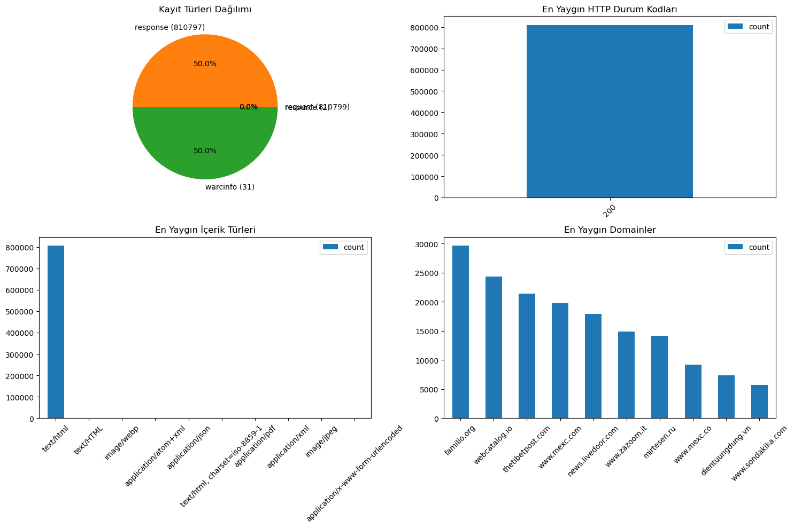
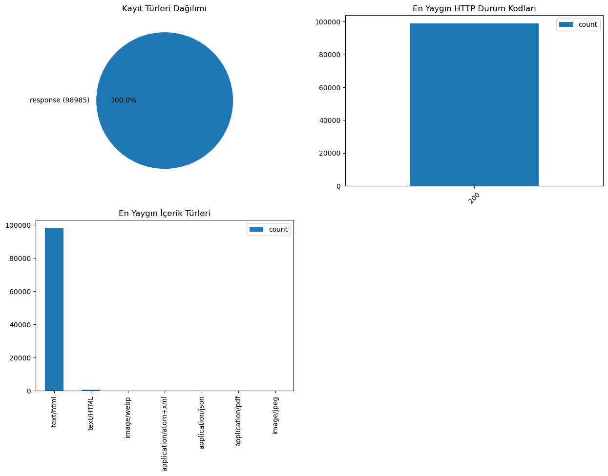

# Sub-sampling statistics

Kullanılan dosyalar: 
CC-NEWS-20200110212037-00310.warc
CC-NEWS-20250101020153-00156.warc
CC-NEWS-20250101055537-00157.warc
CC-NEWS-20250101083312-00158.warc
CC-NEWS-20250101110352-00159.warc
CC-NEWS-20250101133323-00160.warc
CC-NEWS-20250101160900-00161.warc
CC-NEWS-20250101182853-00162.warc
CC-NEWS-20250101204758-00163.warc
CC-NEWS-20250101233509-00164.warc
CC-NEWS-20250102025043-00165.warc
CC-NEWS-20250102053830-00166.warc
CC-NEWS-20250102074538-00167.warc
CC-NEWS-20250102092617-00168.warc
CC-NEWS-20250102110149-00169.warc
CC-NEWS-20250102122438-00170.warc
CC-NEWS-20250102140759-00171.warc
CC-NEWS-20250102155145-00172.warc
CC-NEWS-20250102173620-00173.warc
CC-NEWS-20250102192440-00174.warc
CC-NEWS-20250102214004-00175.warc
CC-NEWS-20250103000559-00176.warc
CC-NEWS-20250103031223-00177.warc
CC-NEWS-20250103060152-00178.warc
CC-NEWS-20250103080404-00179.warc
CC-NEWS-20250103095544-00180.warc
CC-NEWS-20250103114344-00181.warc
CC-NEWS-20250103131849-00182.warc
CC-NEWS-20250103145501-00183.warc
CC-NEWS-20250103163233-00184.warc
CC-NEWS-20250103181014-00185.warc

### WARC Dosya İstatistikleri ###
Total WARC file count: 31
Total WARC file size: 37.5 GB
Total record count: 1621629

Kayıt Türleri Dağılımı:
  - request: 810799 (50.00%)
  - response: 810797 (50.00%)
  - warcinfo: 31 (0.00%)
  - resource: 2 (0.00%)

En Yaygın İçerik Türleri (ilk 10):
  - text/html: 807240
  - text/HTML: 606
  - image/webp: 121
  - application/atom+xml: 71
  - application/json: 68
  - text/html, charset=iso-8859-1: 24
  - application/pdf: 5
  - application/xml: 3
  - image/jpeg: 3
  - application/x-www-form-urlencoded: 2

En Yaygın HTTP Durum Kodları:
  - 200: 810797

En Yaygın Domainler (ilk 10):
  - familio.org: 29673
  - webcatalog.io: 24311
  - thetibetpost.com: 21395
  - www.mexc.com: 19736
  - news.livedoor.com: 17898
  - www.zazoom.it: 14853
  - mirtesen.ru: 14158
  - www.mexc.co: 9231
  - dientuungdung.vn: 7336
  - www.sondakika.com: 5670

Bu 31 dosyadan Türkçe içerikler alındı. Bunun istatistikleri aşağıdaki gibi:

### 'website_data.warc' Dosyası İstatistikleri ###
Dosya boyutu: 16.3 GB
Toplam kayıt sayısı: 98985

Kayıt Türleri Dağılımı:
  - response: 98985 (100.00%)

En Yaygın İçerik Türleri (ilk 10):
  - text/html: 97978
  - text/HTML: 606
  - image/webp: 121
  - application/atom+xml: 68
  - application/json: 68
  - application/pdf: 4
  - image/jpeg: 1

En Yaygın HTTP Durum Kodları:
  - 200: 98985

En Yaygın Domainler (ilk 10):
  - webcatalog.io: 24311
  - www.sondakika.com: 5670
  - www.goal.com: 4414
  - www.finanznachrichten.de: 3064
  - quran.com: 2621
  - www.haberler.com: 2469
  - www.haberturk.com: 1915
  - www.dw.com: 1626
  - dunya.com.pk: 1384
  - www.augsburger-allgemeine.de: 1230

Ortalama URL uzunluğu: 98.02 karakter

